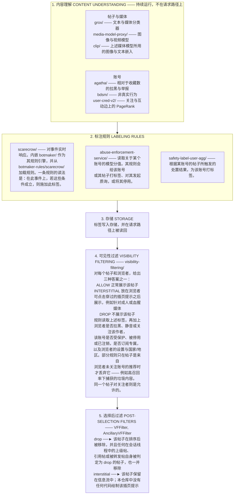

# X For You 信息流算法

本仓库包含决定用户在 X 的 **For You**（为你推荐）信息流中看到哪些帖子的核心代码。它把来自关注账号的网内内容与通过基于机器学习的召回等机制发现的网外内容结合起来，依据多种输入对内容进行过滤，并使用一个 Transformer 模型对帖子排序。

> **说明**：本文件是 [README.md](README.md) 的中文译本，方便中文读者阅读。如与英文原文有出入，以英文原文为准；代码路径、标识符与链接均保持原样。

**中文本地化索引**（本仓库已有的中文译本）

- [`README.zh-CN.md`](README.zh-CN.md) ← `README.md`
- [`docs/BIDIRECTIONAL_BOOST_CHANGE.zh-CN.md`](docs/BIDIRECTIONAL_BOOST_CHANGE.zh-CN.md) ← `docs/BIDIRECTIONAL_BOOST_CHANGE.md`
- [`phoenix/README.zh-CN.md`](phoenix/README.zh-CN.md) ← `phoenix/README.md`
- [`phoenix/QUICKSTART.zh-CN.md`](phoenix/QUICKSTART.zh-CN.md) ← `phoenix/QUICKSTART.md`
- [`phoenix/TRAINING.zh-CN.md`](phoenix/TRAINING.zh-CN.md) ← `phoenix/TRAINING.md`
- [`phoenix/reference/README.zh-CN.md`](phoenix/reference/README.zh-CN.md) ← `phoenix/reference/README.md`
- [`bdsm/README.zh-CN.md`](bdsm/README.zh-CN.md) ← `bdsm/README.md`

`CODE_OF_CONDUCT.md` 与 `phoenix/THIRD_PARTY_NOTICES.md` 有意保留英文原文（后者为第三方许可声明，属法律文本）。

---

## 目录

- [重要更新](#重要更新)
  - [2026 年 8 月 14 日](#2026-年-8-月-14-日)
  - [2026 年 8 月 13 日](#2026-年-8-月-13-日)
- [概览](#概览)
- [系统架构](#系统架构)
  - [请求路径](#请求路径)
  - [标注路径](#标注路径)
- [组件](#组件)
- [工作原理](#工作原理)
  - [评分与排序](#评分与排序)
  - [过滤](#过滤)
- [实验与配置](#实验与配置)
- [本仓库不包含哪些内容](#本仓库不包含哪些内容)
- [Under the Hood 标签透明工具](#under-the-hood-标签透明工具)
- [关键设计决策](#关键设计决策)
- [许可证](#许可证)

---

## 重要更新

### 2026 年 8 月 14 日

重要更新：

- **权重是怎么起作用的。** 关于与各类行为（如点赞 Like、分享 Share、拉黑 Block、举报 Report 等）相关的权重在排序中如何起作用，存在一个常见的误解。这些权重是用来缩放**预测出的概率**（或预测出的连续值，例如停留时长）的，它们**并不**缩放原始的互动计数。因此，如果看到举报的权重是点赞的 468 倍，就推断出「1 次举报可以抵消 468 次点赞」，那是不正确的。权重是对你自身「会点赞」「会举报」等预测概率的倍数，而这个概率在很大程度上由你自己的行为决定。我们已在[代码](home-mixer/params/param.rs)中[补充了注释](home-mixer/scorers/ranking_scorer.rs)，以便阅读代码的大语言模型或人类更容易正确理解这一点。
- **2026 年巴西选举。** 如 [X 官方公告](https://x.com/XBR/status/2088341967864320507?s=20)所述，依照巴西选举法，For You 现在会运行 `Brazil2026ElectionFilter`，它会移除被巴西选举法院就 2026 年选举通报的账号所发布的帖子，除非浏览者明确关注了该账号。*（账号名单已于 2026 年 8 月 27 日更新。）* 开源的一个好处是，你能看到这类变更确实存在，以及它们究竟是如何工作的——不妨[看看这段代码](home-mixer/filters/brazil_2026_election_filter.rs)。

### 2026 年 8 月 13 日

本次发布：

- 新增了关键配置参数（包括用于把预测的行为值混合成一个帖子分值的权重）
- 新增了会影响帖子是否被从 For You 信息流中过滤掉的系统代码
- 用信息流实际使用的模型训练代码替换了 Phoenix 演示模型，同时提供了合成数据生成代码，以便可以跑一次 Phoenix 的概念验证训练

新增的系统包括：

1. **可见性过滤：** [`visibility-filtering/`](visibility-filtering/) 决定一个帖子是展示、丢弃，还是放在插页提示之后展示。
2. **为可见性过滤产出标签的系统：** 施加标签的规则（[`botmaker/`](botmaker/)、[`botmaker-rules/`](botmaker-rules/)、[`scarecrow/`](scarecrow/)），在多个维度对账号打分的模型（[`agatha/`](agatha/)、[`bdsm/`](bdsm/)、[`user-cred-v2/`](user-cred-v2/)），检查图像和视频的模型（[`media-model-proxy/`](media-model-proxy/)、[`clip/`](clip/)），以及处置执行（[`abuse-enforcement-service/`](abuse-enforcement-service/)）。
3. **Phoenix 模型代码：** [`phoenix/`](phoenix/) 现在包含训练和运行该模型的代码，以及合成数据生成。
4. **SimClusters：** [`simclusters/`](simclusters/)，在与 Thunder、Phoenix 召回并列的召回环节中被调用，是浏览者未关注账号的帖子的另一个来源。

本次更新还配套上线了一个新的[**Under the Hood**](#under-the-hood-标签透明工具)透明工具，让用户可以查看自己账号和帖子上那些可能限制可见性的标签的汇总统计。

---

## 概览

For You 信息流是按每次请求实时组装的。帖子来自两个地方：

1. **网内（In-Network）** — [`thunder/`](thunder/) 在内存中保存浏览者所关注账号的近期帖子
2. **网外（Out-of-Network）** — [`phoenix/`](phoenix/) 召回与 [`simclusters/`](simclusters/) 找出浏览者未关注账号的帖子

两者由同一个模型统一排序。**Phoenix** 读取浏览者近期的互动历史，针对每个帖子预测浏览者可能对其采取各种行为的概率。这些预测值按代码中持有的权重组合成一个分值——参见[评分与排序](#评分与排序)。

两条流水线承担这些工作。**帖子流水线（Post Pipeline）** 负责找出、排序和过滤帖子。**混排流水线（Blending Pipeline）** 将其包裹起来，加入模型不参与排序的内容：广告、推荐关注（Who to Follow）、提示卡。

排序决定顺序。一个帖子最终能否被展示，则另由 [`visibility-filtering/`](visibility-filtering/) 决定，依据的是浏览者自己的操作（如拉黑、静音）以及本仓库其他系统打到帖子和账号上的标签。

---

## 系统架构

> 原文使用 ASCII 图，此处为便于中英混排阅读改绘为流程图；结构与环节与原文一致。

### 请求路径

```mermaid
flowchart TD
    REQ(["FOR YOU 信息流请求"]) --> HM["home-mixer/"]

    subgraph POST["帖子流水线 Post Pipeline · PhoenixCandidatePipeline"]
        direction TB
        S1["1. 查询数据补全 QUERY HYDRATION<br/>用户行为序列 —— 浏览者近期的互动记录，是模型的主要输入<br/>关注列表 · 拉黑与静音 · 静音关键词 · 已看过/已投放的帖子 · 已关注话题等"]
        S2["2. 候选来源 CANDIDATE SOURCES —— 并行查询<br/>网内：Thunder —— 浏览者所关注账号的近期帖子<br/>网外：Phoenix 召回（召回模型）· SimClusters（簇相似度）"]
        S3["3. 候选数据补全 CANDIDATE HYDRATION<br/>帖子文本与媒体 · 作者信息与账号标签 · 引用帖 · 语言 · 互动计数 · 订阅状态等"]
        S4["4. 打分前过滤 PRE-SCORING FILTERS<br/>跨来源重复 · 超过 48 小时 · 浏览者自己的帖子 · 被拉黑与静音的账号<br/>静音关键词 · 已看过或已投放 · 浏览者无法访问的订阅专属帖等"]
        S5["5. 打分 SCORING<br/>PhoenixScorer —— 预测浏览者可能采取的每个行为的概率<br/>RankingScorer —— 加权求和，再做重复作者衰减、网外折扣、新作者提升<br/>VMRanker —— 调用 vm-ranker/ 中的重排服务"]
        S6["6. 选择 SELECTION · TopKScoreSelector<br/>按最终分值排序，保留前 K 条"]
        S7["7. 选择后过滤 POST-SELECTION FILTERS —— 顺序固定之后<br/>VFCandidateHydrator 逐个帖子和浏览者询问 visibility-filtering/<br/>VFFilter 移除被判定为 drop 的帖子<br/>DedupConversationFilter 合并同一会话的多个分支<br/>◄── 这些标签来自标注路径"]
        S1 --> S2 --> S3 --> S4 --> S5 --> S6 --> S7
    end

    subgraph BLEND["混排流水线 Blending Pipeline · ForYouCandidatePipeline"]
        direction TB
        B1["已排序的帖子在这里只是来源之一；其他来源加入非帖子内容：<br/>广告 · 推荐关注 · 提示卡 · push-to-home 等<br/>BlenderSelector 将它们交错排列。默认的广告混排器会为广告的相邻性重排帖子；<br/>推荐关注和提示卡放在固定位置。"]
        B2["副作用 SIDE EFFECTS —— 响应发出之后<br/>记录投放了哪些帖子 · 刷新帖子缓存 · 记录广告与客户端事件等"]
        B1 --> B2
    end

    HM --> POST --> BLEND --> OUT(["排序后的 FOR YOU 时间线"])
```



各阶段可以单独开启和关闭，默认值在 [`home-mixer/params/param.rs`](home-mixer/params/param.rs)——这些默认值与线上实际运行内容的关系，参见[实验与配置](#实验与配置)。

### 标注路径



---

## 组件

### Home Mixer 与候选流水线

| 组件                                        | 作用                                                                                                                        |
| ------------------------------------------- | --------------------------------------------------------------------------------------------------------------------------- |
| [`home-mixer/`](home-mixer/)                | 构建 For You 信息流：流水线各阶段、打分权重，并在请求路径上调用其他系统。                                                  |
| [`candidate-pipeline/`](candidate-pipeline/) | `home-mixer` 所基于的框架。定义了各阶段类型——来源、数据补全、过滤、打分、选择、副作用——并运行它们，在可并行处并行执行。 |

### 候选来源

| 组件                             | 作用                                                                             |
| -------------------------------- | -------------------------------------------------------------------------------- |
| [`thunder/`](thunder/)           | 在帖子发布时将其保存在内存中，并返回浏览者所关注账号的近期帖子。                 |
| [`phoenix/`](phoenix/) 召回      | 将浏览者和每个帖子都嵌入为向量，返回与浏览者最接近的帖子。                       |
| [`simclusters/`](simclusters/)   | 按「谁与什么互动」对账号和帖子聚类，再借助这些簇来寻找候选内容。                 |

### 召回索引

| 组件                                                 | 作用                                                             |
| ---------------------------------------------------- | ---------------------------------------------------------------- |
| [`phoenix-rankall/`](phoenix-rankall/)               | 维护 Phoenix 召回所查询的帖子索引，并随事件到达更新它。          |
| [`phoenix-rankall-strato/`](phoenix-rankall-strato/) | 事件层，决定一个帖子应归属哪个索引，并先咨询可见性过滤。         |

### 排序

| 组件                           | 作用                                                                                                                                                                       |
| ------------------------------ | -------------------------------------------------------------------------------------------------------------------------------------------------------------------------- |
| [`phoenix/`](phoenix/) 排序    | 预测浏览者对每个帖子采取各个行为的可能性。训练与服务代码使用 JAX，配一个 Rust 服务层。                                                                                     |
| [`vm-ranker/`](vm-ranker/)     | `VMRanker` 在帖子打分完成后调用的服务。它用帖子嵌入上的行列式点过程对帖子重排，牺牲一点分值换取相邻内容之间更低的相似度。                                                  |

### 内容理解

这些系统产出可见性过滤所读取的分值与标签。

| 组件                                       | 作用                                                                                                                                                                       |
| ------------------------------------------ | -------------------------------------------------------------------------------------------------------------------------------------------------------------------------- |
| [`grox/`](grox/)                           | 在帖子发布时运行。包含垃圾内容、成人内容、暴力媒体等类别的分类器，以及帖子文本与图像的数值表示。                                                                           |
| [`media-model-proxy/`](media-model-proxy/) | 为图像和视频模型提供服务：成人内容、暴力与血腥、仇恨符号、题材，以及与已知媒体的匹配。                                                                                     |
| [`clip/`](clip/)                           | 训练图像与文本嵌入模型，上述分类器将其媒体嵌入作为输入。                                                                                                                   |
| [`agatha/`](agatha/)                       | 离线批处理任务，依据他人对该账号帖子的反馈为账号打标签：相对于收藏数的拉黑、举报与垃圾举报，以及垃圾内容停用标签和成人内容标签。                                           |
| [`bdsm/`](bdsm/)                           | 读取账号随时间发生的行为序列，识别非真实或滥用行为的迹象。                                                                                                                 |
| [`user-cred-v2/`](user-cred-v2/)           | 在关注图和互动边上运行 PageRank，并将得到的质量转换为按账号的分数。                                                                                                         |
| [`adult-content/`](adult-content/)         | 训练并校准成人媒体分类器。                                                                                                                                                 |
| [`pnsfwmedia/`](pnsfwmedia/)               | 成人媒体分类器，将 CLIP 媒体嵌入与账号级分数（包括来自 `agatha` 的已校准分数）结合起来。                                                                                    |

### 可见性过滤

| 组件                                                           | 作用                                                                                                                                                                            |
| -------------------------------------------------------------- | ------------------------------------------------------------------------------------------------------------------------------------------------------------------------------- |
| [`visibility-filtering/`](visibility-filtering/)               | 决定一个帖子是否展示给某个浏览者。规则位于 [`rules/registry.rs`](visibility-filtering/rules/registry.rs)。                                                                    |
| [`scarecrow/`](scarecrow/)                                     | 对事件实时施加标签规则。内嵌 `botmaker` 作为其规则引擎。                                                                                                                        |
| [`botmaker/`](botmaker/)                                       | 那个规则引擎：规则的书写语言、其编译器与运行时。                                                                                                                                |
| [`botmaker-rules/`](botmaker-rules/)                           | `scarecrow` 加载的规则。为降低被钻空子绕过这些系统的风险，部分规则目前不在本仓库中。                                                                                            |
| [`abuse-enforcement-service/`](abuse-enforcement-service/)     | 依据关于账号的模型分值而非事件来采取行动：给该账号或其帖子打标签、发起质询，或停用账号。                                                                                        |
| [`safety-label-user-agg/`](safety-label-user-agg/)             | 根据某账号的帖子所触发的处置结果，为该账号打标签。                                                                                                                              |
| [`visibility-filtering-client/`](visibility-filtering-client/) | 调用方用来访问可见性过滤的客户端，以及它用于应答的帖子安全标签类型。                                                                                                            |
| [`under-the-hood/`](under-the-hood/)                           | 构建按账号的 [Under the Hood](#under-the-hood-标签透明工具) 报告：日常任务收集施加到某账号及其帖子上的标签，服务层再按时间段做汇总。                                          |

---

## 工作原理

### 评分与排序

Phoenix 为每个行为预测一个概率：

```
互动     点赞 · 回复 · 转发 · 引用 · 分享 · 通过私信分享 · 通过复制链接分享
点击     帖子 · 个人主页 · 链接 · 展开图片 · 打开视频 · 引用帖
注意力   视频质量观看 · 停留 · 停留时长 · 点击后停留时长 · 活跃秒数
作者     关注作者
负面     不感兴趣 · 静音作者 · 拉黑作者 · 举报 · 未停留
```

`RankingScorer` 将它们组合起来：

```
最终分值 = Σ (权重_i × P(行为_i))
```

正向行为带正权重，负向行为带负权重。权重在 [`home-mixer/params/param.rs`](home-mixer/params/param.rs)；运算逻辑在 [`home-mixer/scorers/ranking_scorer.rs`](home-mixer/scorers/ranking_scorer.rs)。

关于权重，有一个常见的误解需要注意：权重缩放的是预测概率（或预测的连续值，例如停留时长），它**并不**缩放原始的互动计数。因此，如果看到举报的权重是点赞的 468 倍，就推断出「1 次举报可以抵消 468 次点赞」，那是不正确的。权重是对你自身「会点赞」「会举报」等预测概率的倍数，而这个概率在很大程度上由你自己的行为决定。

随后有三项调整：

- **作者多样性（Author Diversity）**：同一作者的第一条之后的每条帖子，都乘以一个递减因子，直至一个下限。
- **网外折扣（Out-of-Network Discount）**：来自浏览者未关注账号的帖子乘以一个小于 1 的因子；浏览者已关注账号的回复和转发同样适用。
- **新作者提升（New-Author Boost）**：曝光量低于某个阈值的作者的帖子，会被上抬至一个目标位置。

之后 `VMRanker` 调用 [`vm-ranker/`](vm-ranker/)——一个独立服务，对结果重新排序。

### 过滤

**打分前过滤**（[`home-mixer/filters/`](home-mixer/filters/)），按顺序执行：

| 过滤器                            | 移除的内容                                                               |
| --------------------------------- | ------------------------------------------------------------------------ |
| `DropDuplicatesFilter`            | 被多个来源返回的同一条帖子                                               |
| `CoreDataHydrationFilter`         | 文本与元数据加载失败的帖子                                               |
| `AgeFilter`                       | 超过 48 小时的帖子                                                       |
| `SelfTweetFilter`                 | 浏览者自己的帖子                                                         |
| `OONRetweetReplyFilter`           | 来自浏览者未关注账号的转发和回复，以及上级帖缺失的回复                   |
| `OONNsfwSimclustersFilter`        | 在浏览者未关注该作者时，作者被标记为成人内容的 SimClusters 帖子          |
| `RetweetDeduplicationFilter`      | 对同一帖子的重复转发                                                     |
| `IneligibleSubscriptionFilter`    | 浏览者无法访问的订阅专属帖                                               |
| `PreviouslySeenPostsFilter`       | 浏览者已经看过的帖子                                                     |
| `PreviouslySeenPostsBackupFilter` | 同上，来自第二份曝光记录                                                 |
| `PreviouslyServedPostsFilter`     | 本次会话中此前已投放的帖子                                               |
| `MutedKeywordFilter`              | 命中浏览者静音关键词的帖子                                               |
| `AuthorSocialgraphFilter`         | 来自浏览者拉黑或静音账号的帖子                                           |
| `VideoFilter`                     | 当请求排除视频时，移除视频帖                                             |
| `TopicIdsFilter`                  | 不在所请求话题内的帖子，以及位于被排除话题中的帖子                       |
| `NewUserMinEngagementFilter`      | 对新账号而言，互动量低于阈值的网外帖子                                   |
| `InventoryHoldoutFilter`          | 按配置比例抽出的帖子，按帖子和浏览者确定性选取                           |

对「已看过」的帖子做了双重处理：`ThunderSource` 会接收到该列表并排除它们，其余来源不会，因此来自其余来源的重复帖由上面的过滤器捕获。

**选择后过滤：**

| 过滤器                    | 移除的内容                                             |
| ------------------------- | ------------------------------------------------------ |
| `VFFilter`                | `visibility-filtering/` 应答为 drop 的帖子             |
| `AncillaryVFFilter`       | 其上级帖、引用帖或被转发帖自身被判定为 drop 的帖子     |
| `DedupConversationFilter` | 同一会话的其余分支                                     |

关于规则如何运行，有两点需要了解：

- 第一条应答为 drop 的规则会终止评估。
- 另有一组规则只在帖子是来自浏览者未关注账号的推荐时才生效，且这些规则只能 drop——例如高召回率下捕获的垃圾内容。同一个帖子对关注者则是允许的。两组规则都在 [`visibility-filtering/rules/registry.rs`](visibility-filtering/rules/registry.rs) 中按评估顺序列出。

---

## 实验与配置

为了持续改进算法，我们会定期在一小部分时间线流量上做实验。我们的目标是：在显著流量占比（例如 10% 或以上）上运行的实验，能在这个仓库中可见。

为支持实验，许多可调值是从配置系统读取的，而非写死在代码里。为帮助大家理解线上默认值，我们运行定时脚本，把本仓库代码中的默认值设置为线上主值，例如 [`home-mixer/params/param.rs`](home-mixer/params/param.rs)。

[`docs/BIDIRECTIONAL_BOOST_CHANGE.md`](docs/BIDIRECTIONAL_BOOST_CHANGE.md) 跟踪了一次被广泛讨论的时间线变更，可以作为「一个参数值随时间变化时你会看到什么」的范例。

---

## 本仓库不包含哪些内容

我们相信透明对信任至关重要，目标是让公众能够理解帖子在 X 上是如何被分发的，从而可以审计、批评甚至参与改进这套系统。

公开会影响帖子分发的代码，其中一个挑战是：有人可能用它来尝试钻系统空子。为降低这种风险，有少量文件目前未在仓库中发布，例如：

- Grox 的提示词，例如 Grox 中使用的含具体 LLM 提示词的 j2 文件。
- 部分 botmaker 规则。

不过，我们仍然希望公众能对这些系统有认识。为此，我们正在试点一个新的[透明工具](#under-the-hood-标签透明工具)，它会向用户展示施加到其账号和帖子上的、影响可见性的标签。这种方式有多重好处：

- 可以看到这些系统的结果（以及是否影响到你自己的账号）
- 可以看到是否有标签是在自动化系统之外被人工施加的
- 可以把账号上出现的任何标签与代码对应起来，理解其帖子的可见性是否或如何受到影响，并在需要时提出批评

我们认为「代码 + 透明输出」的组合对公共透明非常有力，也欢迎反馈。

### 部署相关代码

本仓库的重点是让影响 For You 时间线帖子可见性的代码可被审视。这里所有代码都可被检视，部分代码甚至被设计为可以端到端运行——例如训练并运行 Phoenix 打分模型。在代码意在被构建和运行的地方，相关清单文件都在仓库中，例如 [`phoenix/`](phoenix/) 提供了 Cargo 工作区、`pyproject.toml`、一份[快速上手](phoenix/QUICKSTART.md)和合成数据生成，因此一个小模型可以端到端地完成训练与服务。在其他地方，代码不一定包含构建或部署相关文件，也可能包含并非显而易见的基础设施导入（例如 `xai_service_runner` 或 `xai_kafka`）。如果有任何你认为有助于理解该算法、但此处缺失的内容，请告诉我们。

---

## Under the Hood 标签透明工具

我们正在试点一个新的透明工具，让用户可以看到自己账号和帖子上那些影响可见性的标签的汇总统计。配合本仓库中的代码，我们认为这能让用户对自己帖子的可见性获得有价值的认识。

该工具[在此处可用](https://x.com/i/under_the_hood)——我们会根据大家的反馈持续打磨它并逐步扩大可用范围。构建该报告的任务与服务代码位于 [`under-the-hood/`](under-the-hood/)。

---

## 关键设计决策

### 1. 多行为预测

模型不预测单一的「相关性」分值，而是预测许多行为的概率。把它们组合成一个数字是一个独立且显式的步骤。

### 2. 排序中的候选隔离

在 Transformer 推理期间，候选之间不能相互注意——只能注意浏览者上下文。这确保一条帖子的分值不依赖于批次中还有哪些其他帖子，使分值具有一致性和可缓存性。

### 3. 基于哈希的嵌入

召回和排序都使用多个哈希函数做嵌入查找，因此无需维护词表，新帖子可以立即被表示。

### 4. 排序与可见性相互独立

排序决定顺序，可见性过滤决定一个帖子能否被展示。不同的服务、不同的输入、不同的规则。

### 5. 可组合的流水线架构

`candidate-pipeline` crate 提供了一套灵活的框架，用于构建推荐流水线，具备：

- 将流水线的执行与监控同业务逻辑分离
- 独立阶段的并行执行与优雅的错误处理
- 易于新增来源、数据补全、过滤器和打分器

---

## 许可证

基于 Apache License 2.0 授权。参见 [LICENSE](LICENSE)。
