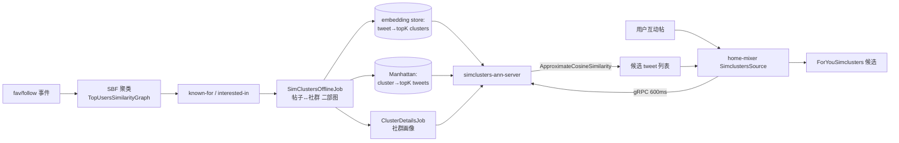

# 06 — simclusters 社群聚类模块导读

本篇讲 `simclusters/`：它是 For You 推荐里 `SimClustersSource` 这一路**召回**的后端（承接 02 篇：`SimClustersSource` 是 `PhoenixCandidatePipeline` 的 7 个源之一）。它的核心思想可以一句话说清——**先把用户和内容都投到同一个"社群（cluster）"向量空间，召回时变成"在社群空间里找相似"的近邻检索**。

> 所有结论均来自仓库代码，括号内为源文件路径，可自行核对。

## 1. 在系统中的位置

```
用户最近互动过的帖(tweet)  ──embeddings──┐
                                         ▼
                              simclusters 社群空间 (cluster ∈ Int)
                                         │  top-K clusters
                                         ▼
                          cluster → top-K tweets 索引
                                         │  ApproximateCosineSimilarity 打分
                                         ▼
home-mixer: SimclustersSource ──gRPC──> simclusters-ann-server ──> 候选 tweet 列表
                                         （ForYouSimclusters served_type）
```

`SimClustersSource` 只在"网络外召回"场景启用：`enable()` 要求 `EnableSimclustersSource` 为真、`!in_network_only`、`!has_cached_posts`，且用户有互动信号（`home-mixer/sources/simclusters_source.rs:88`）。

## 2. 目录结构与职责

`simclusters/` 拆成两个子模块，分别对应**离线产出**与**在线服务**：

| 目录 | 角色 | 代表性文件 |
|---|---|---|
| `simclusters_v2/scalding/` | 离线批处理（Scalding/DAL）：聚类、embedding、社群统计 | `TopUsersSimilarityGraph.scala`、`ClusterDetailsJob.scala`、`SimClustersOfflineJob.scala`、`InterestedInFromKnownFor.scala` |
| `simclusters_v2/summingbird/` | 近实时聚合（Summingbird/Storm）+ 在线读 store | `stores/TopKTweetsForClusterReadableStore.scala`、`storm/TweetJobRunner.scala` |
| `simclusters_v2/common/` | 数据结构与算法原语 | `SimClustersEmbedding.scala`、`SimClustersEmbeddingId.scala`、`CosineSimilarityUtil.scala`、`package.scala` |
| `simclusters_v2/candidate_source/` | Scala 侧 ANN 召回源（frigate `CandidateSource`） | `SimClustersANNCandidateSource.scala`、`HeavyRanker.scala` |
| `simclustersann/` | **在线 gRPC 服务**（Finatra ThriftServer）：被 home-mixer 调用 | `SimclustersAnnServer.scala`、`candidate_source/SimClustersANNCandidateSource.scala`、`candidate_source/ApproximateCosineSimilarity.scala`、`controllers/GetTweetCandidatesGrpcController.scala` |

`home-mixer` 走的是**右侧** `simclustersann` 这条 gRPC 链路；`simclusters_v2/candidate_source` 是同一套 ANN 逻辑的 Scala 内部实现（额外挂了 `HeavyRanker`），供 Scala 推荐服务使用。

## 3. 核心数据结构

### 3.1 SimClustersEmbedding：社群空间里的稀疏向量

一个 embedding 就是"实体（用户/帖子/生产者）在哪些社群上、各有多少分"的稀疏向量（`simclusters_v2/common/SimClustersEmbedding.scala:11`）：

```scala
sealed trait SimClustersEmbedding {
  private[simclusters_v2] val clusterIds: Array[ClusterId]   // = Array[Int]
  private[simclusters_v2] val scores: Array[Double]
  private[simclusters_v2] val sortedClusterIds: Array[ClusterId]
  private[simclusters_v2] val sortedScores: Array[Double]
}
```

- `ClusterId` 就是 `Int`（`common/package.scala:7`），sorted 数组用于做**归并式**点积（见 3.3）。
- 构造时过滤掉非正分、按 `clusterId` 排序缓存，并提供 `dotProduct` / `cosineSimilarity` / `jaccardSimilarity` / `fuzzyJaccardSimilarity` / `euclideanDistance` 等（`SimClustersEmbedding.scala:136-241`）。
- 归一化有多种：`l2norm`（默认）、`logNorm`、`expScaledNorm`（指数 `DefaultExponent = 0.3`，`SimClustersEmbedding.scala:344`）。

### 3.2 SimClustersEmbeddingId：实体 + 类型 + 模型版本

每个 embedding 由三元组唯一标识（`common/SimClustersEmbeddingId.scala:17`）：`(EmbeddingType, ModelVersion, InternalId)`。代码里分了 5 大类 embedding 类型：

| 类别 | 默认类型 | 例子中用途 |
|---|---|---|
| Tweet（帖子） | `LogFavLongestL2EmbeddingTweet` | 帖子→社群 membership，是线上召回的**查询向量** |
| UserInterestedIn（用户兴趣） | `FavBasedUserInterestedIn` | 用户→社群兴趣 |
| Producer（生产者） | `FavBasedProducer` | 账号"擅长什么社群" |
| LocaleEntity / Topic | `FavTfgTopic` / `LogFavBasedKgoApeTopic` | 地域/主题实体 |
| 默认模型版本 | `Model20m145k2020`（`SimClustersEmbeddingId.scala:19`） | 145k 个社群、20M 规模 |

### 3.3 为什么用"排序数组 + 归并"算相似度

`CosineSimilarityUtil.dotProductForSortedClusterAndScores`（`CosineSimilarityUtil.scala:137`）对两个**按 clusterId 升序**的数组做双指针归并，只在 clusterId 相等的维度上相乘累加。这把稀疏向量的点积从 O(n) 降到 O(交集大小)，是后文在线打分性能的基础。

## 4. 离线产出流程

离线要同时产出**两个方向**的二部图：`帖子→Top-K 社群`（查询向量）和 `社群→Top-K 帖子`（检索索引）。

### 4.1 社群从哪来：SBF（Metropolis-Hastings）聚类

用户社群由 `TopUsersSimilarityGraph` 用 **SBF 算法**（`com.twitter.sbf.core`）生成：

1. 选出"高活跃粉丝数"的 top 用户（`TopUsersSimilarityGraph.scala:42` `topUsers`，阈值 `minActiveFollowers`）；
2. 在 top 用户之间建相似度图（`makeGraph` / `convertIterableToGraph`，`Graph` 来自 `sbf.graph`）；
3. 跑 `MHAlgorithm`（Metropolis-Hastings 采样）得到社群分配 `z` / `optimizedZ`，并用 `heuristicallyScoreClusterAssignments` 给社群打分（`TopUsersSimilarityGraph.scala:671-699`）。

> 代码里还留了另一种聚类实现 `ConnectedComponentsClusteringMethod`（`common/clustering/`）：按 `similarityThreshold` 连边后求连通分量。SBF 是主路径，连通分量可作为替代。

生产者社群走 `UpdateKnownForSBFRunner`（`update_known_for/`），同样基于 SBF。

### 4.2 known-for → interested-in 的派生链

`InterestedInFromKnownFor`（如 `InterestedInFromKnownFor20M145K2020`，`scalding/InterestedInFromKnownFor.scala:25`）把生产者的 `ClustersUserIsKnownFor` 转成用户的 `ClustersUserIsInterestedIn`——即"你常消费的生产者属于哪些社群，你也就对哪些社群感兴趣"。输出是 `KeyVal[Long, ClustersUserIsInterestedIn]` 数据集。

### 4.3 二部图的两条聚合（`SimClustersOfflineJob`）

`SimClustersOfflineJob`（`scalding/offline_job/SimClustersOfflineJob.scala`）是串起全链路的核心：

- `computeAggregatedTweetClusterScores`（`:24`）：把 `favoriteData(userId, tweetId, ts)` 与 `userInterestsData(userId → ClustersUserIsInterestedIn)` 做 `leftJoin`，对每条点赞把用户在各社群的分"传播"到该帖，得到带衰减的 `TweetAndClusterScores`（含 `NormalizedFav8HrHalfLife` / `NormalizedFollow8HrHalfLife` / `NormalizedLogFav8HrHalfLife` 三种分），并与历史分用 monoid `sumByKey` 合并。
- `computeTweetTopKClusters`（`:113`）：每帖取 `Configs.topKClustersPerTweet` 个社群、按 `scoreThresholdForEntityTopKClustersCache` 过滤 → `TweetTopKClustersWithScores`（**这就是线上的查询 embedding 来源**）。
- `computeClusterTopKTweets`（`:140`）：每社群取 `Configs.topKTweetsPerCluster` 条帖、按 `scoreThresholdForClusterTopKTweetsCache` 过滤 → `ClusterTopKTweetsWithScores`（**这就是线上的 cluster→tweets 索引来源**）。

### 4.4 社群画像 `ClusterDetailsJob`

`ClusterDetailsJob`（`scalding/ClusterDetailsJob.scala`）按社群聚合：NSFW 用户占比、语言/国家分布、以及用 **QTree**（近似分位数，`algebird.QTree`）统计 follow/fav/logFav 分的分布，产出 `SimplifiedClusterDetails`，供线上做"社群维度"过滤。

### 4.5 存储落地

- 社群→帖子索引落到 Manhattan（或 Memcache），在线经 `TopKTweetsForClusterReadableStore` 读取（`summingbird/stores/TopKTweetsForClusterReadableStore.scala:232` `getClusterToTopKTweetsStoreFromManhattanRO`）。
- 各类 embedding 经 `SimClustersEmbeddingStore`（`stores/SimClustersEmbeddingStore.scala`）按 `(EmbeddingType, ModelVersion)` 分桶读取，并用 Decider 做按类型/版本的灰度开关。

## 5. 在线消费方式

### 5.1 home-mixer 侧

`SimclustersSource`（`home-mixer/sources/simclusters_source.rs`）：

- 取用户**最近互动过的帖**作为信号（`post_signal_ids`，按 `engaged_at_ms` 倒序、去重，`simclusters_source.rs:149-173`）；
- 对每条信号帖构造查询：`source_embedding_id` 用 `LOG_FAV_LONGEST_L2_EMBEDDING_TWEET` + `MODEL_20M_145K_2020` + `TweetId(signal_id)`，即**用互动帖自身的 embedding 当查询向量**（`build_query`，`:175`）；
- 配置固定写死（均可改）：`max_scan_clusters=50`、`max_top_tweets_per_cluster=800`、`max_tweet_candidate_age_hours=48`、`ann_algorithm=COSINE_SIMILARITY`、`max_num_results=200`（`:29-34`）；
- 多信号并行 `join_all`，本地后过滤 `score > POST_ANN_MIN_SCORE(0.5)`，按信号**交错（interleave）**后截断到 `MAX_RESULTS=800`，标 `served_type = ForYouSimclusters`（`:108-135`）；
- 结果用 Moka 缓存（200 万条、TTL 600s）减轻回源（`:51`）。

### 5.2 传输与在线服务

`ProdSimClustersAnnClient`（`home-mixer/clients/simclusters_ann_client.rs`）通过 Wily 服务发现 `/s/simclusters-ann/simclusters-ann:grpc`（15 个端点）、gRPC + mTLS、**超时 600ms** 调到 `simclusters-ann-server`。服务端 `SimClustersAnnServer`（`simclustersann/SimclustersAnnServer.scala`）是 Finatra `ThriftServer`，名字 `simclusters-ann-server`，额外在 **9992 端口**起 gRPC（`GetTweetCandidatesGrpcController`，把 Thrift `Query` 序列化进通用 gRPC 通道）。

服务端 `SimClustersANNCandidateSource`（`simclustersann/candidate_source/SimClustersANNCandidateSource.scala`）：

1. `simClustersEmbeddingStore.get(sourceEmbeddingId)` 取查询 embedding；
2. `truncate(config.maxScanClusters)` 只保留 top-50 社群；
3. `clusterTweetCandidatesStore.multiGet(clusterIds)` + `clusterDetailsStore.multiGet(...)` 批量取各社群的候选帖与社群画像；
4. 交给 `ApproximateCosineSimilarity` 打分。

## 6. 聚类/相似度算法细节

### 6.1 "近似"余弦相似度到底近似在哪

`ApproximateCosineSimilarity`（`simclustersann/candidate_source/ApproximateCosineSimilarity.scala:48`）的打分过程：

```
对查询 embedding 的 top-maxScanClusters 个社群 c（且 c 命中 clusterTweetsMap）：
  对社群 c 的 top-maxTopTweetsPerCluster 条候选帖 t：
    candidateScoresMap[t]      += t.score_in_c × source.score_in_c      // 点积分子
    candidateNormalizationMap[t]+= t.score_in_c × t.score_in_c          // 候选 L2 分母
    candidateFavSquaredL2NormMap[t] = t.favSquaredL2Norm                // Fav-L2 变体用

最终分数（CosineSimilarity 分支, :101）：
    score(t) = candidateScoresMap[t] / source.l2norm / sqrt(candidateNormalizationMap[t])
再按 config.minScore 过滤、降序、取 min(maxNumResults, 1000)
```

- **近似点一**：只扫查询向量里权重最高的 `maxScanClusters`（默认 50）个社群，而非全部 145k 个社群——相当于 ANN 里的"先粗筛近邻社群"。
- **近似点二**：每个社群只取 `maxTopTweetsPerCluster`（默认 800）条头部帖，省掉长尾。
- 分子 `Σ_c (source_c × tweet_c)` 正是两个 embedding 在社群空间的点积；`sqrt(Σ tweet_c²)` 是候选向量的 L2 范数（取自索引里存的分数，无需回查候选 embedding）。
- 提供 6 种归一化：`LogCosineSimilarity` / `CosineSimilarity` / `CosineSimilarityFavL2NormBased` / `…WithExploration` / `CosineSimilarityNoSourceEmbeddingNormalization` / `DotProduct`（`:98-122`）。
- 时间过滤用 **SnowflakeId** 把"小时年龄"换算成 tweet id 区间（`earliestTweetId`/`latestTweetId`，`:58-64`），避免对老帖打分。

### 6.2 全链路一图流



## 7. 可以带走的工程经验

1. **召回即"近邻检索"，关键是把两边投到同一空间**。simclusters 用"社群"作为中间表示，用户和帖子共享同一套 cluster id，召回退化为"查社群→展开帖子→打分"，在线常数极小。
2. **离线同时物化二部图的两个方向**（帖子→社群、社群→帖子），在线只做轻量展开 + 点积，把重计算留在批处理。值得抄的是"把二部图双向预计算"的思路。
3. **ANN 的近似必须可控**：`maxScanClusters` / `maxTopTweetsPerCluster` / `maxNumResults` 都是查询级参数，在 home-mixer 侧直接写死成常量并可调——用"扫描多少近邻"换延迟，效果可实验。
4. **稀疏向量用排序数组 + 归并点积**（`CosineSimilarityUtil.dotProductForSortedClusterAndScores`），把 O(n) 降到 O(交集)，是高维稀疏相似度计算的标配优化。
5. **查询向量来自"互动帖"而非"用户画像"**：home-mixer 以用户最近点赞的帖为 seed，做"相似帖"召回。这把"用户兴趣"隐式编码进互动历史，免去了实时算用户 embedding。
6. **在线读路径层层加缓存**：Manhattan RO → Memcache（15min）→ 本地 `ObservedCachedReadableStore`（10min，15 万 key，`ClusterTweetIndexProviderModule.scala:90-112`），多级缓存把热点社群索引压到内存命中。

---

> 下一篇可扩展：`simclusters_v2/candidate_source/SimClustersANNCandidateSource.scala` 的 `HeavyRanker` 重排、以及 `score/`（embedding pair 打分）如何给 simclusters 候选做二次精排——本篇未展开，代码中可查。
