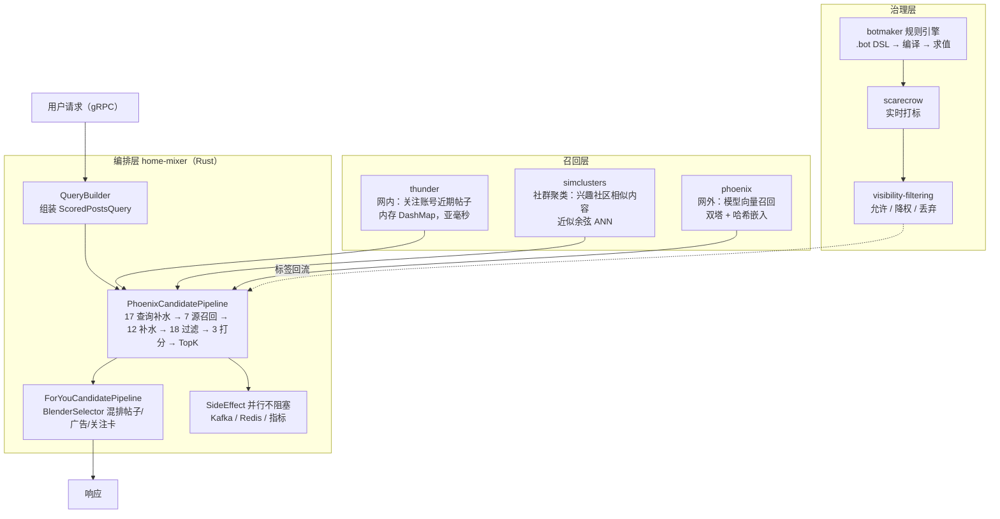

# X 推荐算法源码中文导读

本目录是对 X（Twitter）开源推荐算法仓库 [`xai-org/x-algorithm`](https://github.com/xai-org/x-algorithm)（Apache 2.0）的**中文源码导读**，面向想读懂这套工业级推荐系统的读者。

> **说明**：本导读完全基于本仓库公开代码的阅读整理，不包含任何非公开信息、内部数据或未开源实现。所有结论均标注对应的源文件路径，可自行核对。
>
> **与「翻译」的区别**：上游文档极少（多数模块只有代码、没有 README），信息密度几乎全在代码里。所以这里不做逐行翻译，而是把**代码里的架构、数据流、设计取舍**讲清楚。

## v1 覆盖范围

当前版本（v1）覆盖 For You 信息流的**主链路**：请求编排 → 网内召回 → 社群召回 → 模型召回与排序 → 混排，以及贯穿其上的工程模式。

| 已覆盖 | 未覆盖（后续版本） |
|---|---|
| `candidate-pipeline`（框架） `home-mixer`（编排 + 主链路） `thunder`（网内召回） `simclusters`（社群聚类召回） `phoenix`（模型召回与排序） `botmaker` / `scarecrow`（内容治理） | 广告混排（`home-mixer/ads`） 可见性过滤细节（`visibility-filtering`） 账号信誉与处置链路（`user-cred-v2` / `abuse-enforcement-service`） 媒体理解（`clip` / `media-model-proxy` / `pnsfwmedia`） 生成式推荐（`phoenix` 的 SID / gen-recs 分支） |

## 系统全景

（上图依据 `home-mixer/server.rs`、`home-mixer/candidate_pipeline/*.rs`、`thunder/`、`simclusters/`、`phoenix/`、`botmaker/`、`scarecrow/` 的代码结构绘制。）

## 导读目录

| 篇目 | 内容 | 适合谁 |
|---|---|---|
| [01 — 请求生命周期与流水线框架](01-请求生命周期与流水线框架.md) | 一次 `For You` 请求从 gRPC 入口到返回的完整链路；`candidate-pipeline` 的 10 个阶段抽象与执行顺序；六条并行流水线 | 想先建立全局认知的读者 |
| [02 — home-mixer 核心推荐链路](02-home-mixer核心推荐链路.md) | 7 路召回、17 个查询补水器、12 个候选补水器、18 个过滤器、3 个打分器逐个拆解，含真实权重表 | 想深入推荐链路细节的读者 |
| [03 — 关键设计模式与工程取舍](03-关键设计模式与工程取舍.md) | Prod/Mock 双实现的依赖注入、Feature Switch 参数化、分级处理、副作用解耦、可观测性 | 关注工程架构与可测试性的读者 |
| [04 — thunder 网内召回内存存储](04-thunder网内召回内存存储.md) | 内存存储怎么做到亚毫秒：索引与数据分离、每维度硬上限、删除墓碑、快照+增量冷启动 | 做低延迟内存服务的读者 |
| [05 — phoenix 模型导读](05-phoenix模型导读.md) | 召回（双塔）与排序（候选隔离注意力）模型架构、哈希嵌入、损失函数、训练与运行器、nano 配置 | 关心模型与训练管线的读者 |
| [06 — simclusters 社群聚类导读](06-simclusters社群聚类导读.md) | 用户-社群兴趣表示、近似余弦 ANN 在线服务、离线聚类的物化方向、评分细节 | 关心召回算法与图聚类的读者 |
| [07 — 内容治理规则引擎导读](07-内容治理规则引擎导读.md) | `.bot` 规则 DSL、编译链路、运行时求值与动作分级、scarecrow 实时打标、热更新 | 关心风控/规则引擎设计的读者 |

## 阅读前置知识

- **Rust**：`home-mixer`、`candidate-pipeline`、`thunder` 为 Rust；`simclusters`、`botmaker` 为 Scala；`phoenix`（模型）为 Python + Rust。
- **推荐系统基本概念**：召回（retrieval/sourcing）、精排（ranking/scoring）、重排（selection）、混排（blending）。
- **gRPC / Protobuf**：服务入口与跨服务通信方式（`home-mixer/main.rs` 起 tonic 服务）。

## 模块速查

| 模块 | 语言 | 文件数 | 职责 | 导读 |
|---|---|---|---|---|
| `home-mixer` | Rust | 224 | **推荐主服务**：编排召回、过滤、打分、混排 | [01](01-请求生命周期与流水线框架.md) [02](02-home-mixer核心推荐链路.md) [03](03-关键设计模式与工程取舍.md) |
| `candidate-pipeline` | Rust | 11 | **流水线框架**：阶段抽象与统一执行器 | [01](01-请求生命周期与流水线框架.md) [03](03-关键设计模式与工程取舍.md) |
| `thunder` | Rust | 24 | 网内召回：内存候选存储 | [04](04-thunder网内召回内存存储.md) |
| `phoenix` | Python + Rust | 323 | 召回与排序模型（训练 + 推理） | [05](05-phoenix模型导读.md) |
| `simclusters` | Scala | 232 | 社群聚类召回与 ANN 服务 | [06](06-simclusters社群聚类导读.md) |
| `botmaker` / `botmaker-rules` / `scarecrow` | Scala | 492+ | 内容治理：规则引擎与实时打标 | [07](07-内容治理规则引擎导读.md) |
| 其余模块 | 混合 | — | 广告、安全、可见性过滤、媒体理解等 | 未覆盖 |

## 建议阅读顺序

1. 先读 `candidate-pipeline/`（11 个文件，全框架）——**这是理解全局的钥匙**，所有业务流水线都是它的实例，对应 [01 篇](01-请求生命周期与流水线框架.md)。
2. 再读 `home-mixer/candidate_pipeline/for_you_candidate_pipeline.rs`——最短的一条业务流水线（326 行），看清 stage 怎么装配。
3. 然后进 [02 篇](02-home-mixer核心推荐链路.md) 对应的 `phoenix_candidate_pipeline.rs`（1094 行）——真正的主推荐链路。
4. 按兴趣挑一个模块深入：[04 thunder](04-thunder网内召回内存存储.md)（工程/延迟）、[05 phoenix](05-phoenix模型导读.md)（模型）、[06 simclusters](06-simclusters社群聚类导读.md)（召回算法）、[07 botmaker](07-内容治理规则引擎导读.md)（规则引擎）。
5. 最后读 [03 篇](03-关键设计模式与工程取舍.md) 收口，把可复用的工程经验带走。

## 参与方式

发现导读与代码不符、或想补某个模块，欢迎提 issue / PR。导读与代码不一致时，**以代码为准**。
