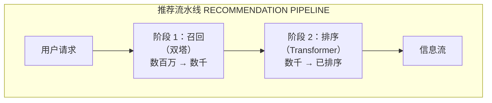
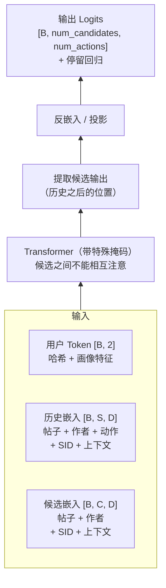

> **说明**：本文件是 [README.md](README.md) 的中文译本。如与英文原文有出入，以英文原文为准；代码、命令、路径与标识符均保持原样。

# Phoenix：推荐系统

本仓库包含 Phoenix 推荐系统的 JAX 代码，它支撑内容排序与召回。Phoenix 在**召回**（从数百万条目中找出相关候选）与**排序**（按预测的互动概率对一小批候选排序）两个环节都采用基于 transformer 的架构。

> **说明：** 较早的发布版本附带的是一份从 [Grok-1 开源版本](https://github.com/xai-org/grok-1)移植而来的样例 transformer。本次发布附带的是**生产实现本身**：真实的模型代码、真实的训练步骤，以及真实的 Rust 服务引擎，均从内部代码树导出。**没有**附带的是 xAI 专有的基础设施（生产数据源、集群编排、内部遥测）——每一处这类接缝都被替换为有文档说明的本地等价实现，并附带了合成数据生成器，使整套系统在无任何外部依赖的情况下端到端运行。有一处训练配方的替换在 [TRAINING.md](TRAINING.md) 中披露：对于位于遗留稠密优化器槽位上的配置，本次导出提供的是标准 AdamW，而非生产环境经过调优的内部变体。旗舰排序配置与 nano 孪生版本训练的是完整的生产 Muon 配方，该配方完整附带。

## 目录

- [概览](#概览)
- [架构](#架构)
  - [两阶段推荐流水线](#两阶段推荐流水线)
  - [召回：双塔模型](#召回双塔模型)
  - [排序：带候选隔离的 Transformer](#排序带候选隔离的-transformer)
- [关键设计决策](#关键设计决策)
- [运行代码](#运行代码)
- [模型架构配置](#模型架构配置)
- [许可证](#许可证)

---

## 概览

Phoenix 是一个推荐系统，用于预测用户对内容的互动（点赞、转发、回复等）。它分两个阶段运作：

1. **召回**：高效地把数百万候选收窄到数百个，用用户嵌入对一份预先算好的候选索引打分
2. **排序**：用表达力更强的 transformer 模型对召回出的候选打分并排序

### 关于本次发布

- **是生产栈，不是样例**：附带的代码树（`xrex/` 加上随附的 `crates/` 引擎工作区）就是生产中训练和运行 Phoenix 的代码——模型定义、训练器、检查点，以及 Rust gRPC 服务引擎（通过 `uv sync --extra engine` 在本地构建）。
- **面向单 GPU 的 nano 配置**：在生产配置之外，两个模型都附带单 GPU 的 `nano` 预设（排序用 `home_direct_packed_nano`，召回用 `xrecsys_two_tower_nano`），它们保留生产的损失函数与特征处理方式，但在宽度/深度/表规模上做了缩小，使训练在数分钟内完成。排序 nano 的几何结构与生产完全一致；召回 nano 还额外以非打包方式和稠密注意力训练，历史长度为 1022 步，且不含用户特征 token（参见下方对比表）。
- **合成数据生成器取代了产物下载**：没有需要拉取的检查点或语料包。`reference/world_snapshots.py` 与 `reference/dump_gen.py` 会生成一个确定性的合成世界——训练 dump、语义 ID 快照、多模态嵌入快照，以及召回候选语料——再由 `reference/train_synth.py` 在其上训练任一模型。以这种方式训练出的检查点，可以通过生产环境所用的同一个引擎承载真实的 gRPC 流量。

---

## 架构

### 两阶段推荐流水线



---

### 召回：双塔模型

召回阶段采用**双塔架构**，以支持大规模的相似度检索。

#### 召回是如何工作的

1. **用户塔**：通过一个 transformer 编码用户的互动历史，产出归一化的用户嵌入 `[B, D]`。该序列是用户的历史加上单个用户特征 token（粗粒度画像特征——国家/地区、语言等，在组合式配置上更多）——生产召回**不携带任何学习得到的按用户 ID 嵌入**（`use_user_embedding=False`）；除了那些画像特征之外，用户由其互动过的内容来表示。（nano 预设去掉了用户特征 token，字面上就是「只有历史」。）
2. **候选塔**：为语料中的所有条目计算归一化嵌入 `[N, D]`。自语义 ID 迁移以来，候选由其**语义 ID**——由每条帖子的多模态嵌入导出的残差量化码（6 级 × 256 码）——加上哈希化的作者 ID 来表示，而不再仅仅由哈希化的帖子 ID 表示。同一话题的帖子共享 SID 前缀，这赋予候选塔对未见帖子的组合式泛化能力。
3. **索引放在检查点里**：每次保存检查点时，训练器都会在配置的语料上运行候选塔，并把生成的索引（`post_embeddings`）**存进检查点内部**。服务时从那里加载——启动时不会有任何东西去嵌入一份语料。
4. **相似度检索**：服务引擎通过用户嵌入与索引之间的点积检索 top-K 候选。

在服务时，召回服务器通过一个语义 ID 查询服务来补全历史 SID；本发布附带了一份基于 parquet 的同一契约实现（`reference/sid_index_server.py`）。

---

### 排序：带候选隔离的 Transformer

排序模型采用一种 transformer 架构，其中**候选之间在推理时不能相互注意**。这是一个关键的设计选择，它确保某个候选的分值不依赖于批次中还有哪些其他候选。

#### 排序模型架构



相比更早的样例发布，输入侧增加了一个**特征准备阶段**：除了哈希化的帖子/作者 ID（以及在历史位置上还有动作嵌入），历史位置和候选位置现在还携带语义 ID 嵌入与上下文特征（时区、本地小时、产品界面、帖子年龄）；历史位置还额外携带停留时长，而一个用户前缀 token 携带画像特征（国家/地区、语言、位置、性别、年龄段、已安装应用）。生产训练还会在每一行中打包多个变长会话（**序列打包**），并使用变长注意力核训练；这两者都是训练吞吐机制——服务时的契约不变。

#### 注意力掩码：候选隔离

一个关键细节是**注意力掩码**，它阻止候选相互注意，同时仍允许它们注意用户与历史：

| Query ↓ ＼ Key → | 用户 | 历史（S 个位置） | 候选（C 个位置） |
| --- | --- | --- | --- |
| **用户** | ✓ | ✓ | ✗ |
| **历史（S 个位置）** | ✓ | ✓ | ✗ |
| **候选（C 个位置）** | ✓ | ✓ | 仅对角线（自注意） |

✓ = 可以注意（1）　　✗ = 不可以注意（0）

图例：

- **用户 + 历史**：彼此之间全双向注意
- **候选 → 用户/历史**：候选**可以**注意用户与历史
- **候选 → 候选**：候选**不可以**相互注意（仅自身）

---

## 关键设计决策

### 1. 基于哈希的嵌入，外加语义 ID

两个模型都为每个实体使用多个哈希函数做嵌入查找——没有字典服务，确定性，并且通过为每个实体组合多个独立的哈希查找，具备容忍冲突的能力。自语义 ID 迁移以来，帖子还额外携带**语义 ID**：对帖子的多模态嵌入做残差量化得到的码，使模型获得纯 ID 哈希无法提供的内容感知泛化能力。

### 2. 共享架构

召回的 user tower 与排序模型使用相同的 transformer 主干与输入机制（组合式召回配置还额外共享排序的「先投影再求和」特征准备阶段；旗舰与 nano 召回配置则使用候选塔的 `enable_linear_proj` 组合方式——一个小的「拼接后接 MLP」）；两个模型的差异在 head，而非主干。

### 3. 多行为预测

排序模型同时预测多种互动类型——在共享分类体系下每个动作一个 logit，作为多标签目标训练——外加针对连续信号（停留时长）的回归 head：

```
输出：[B, num_candidates, num_actions]（+ 连续行为 head）
                        │
                        ▼
        [ 点赞 | 转发 | 回复 | 点击 | ... ]
```

召回以对比方式训练两个塔（批内负样本与采样全局负样本，并做 log-Q 校正），正样本信号为点赞。

### 4. 批不变的服务

候选隔离（排序）与检查点内置索引（召回）二者结合，使服务时的分值与批次组成无关：一个候选的分值只取决于用户和该候选本身。

---

## 运行代码

下面所有内容都可以在这个目录（launchpad 根目录）下运行，无需集群、无需 Kafka、无需生产数据。完整且经过验证的走查——包括预期输出与耗时——见 [`QUICKSTART.md`](QUICKSTART.md)；[`TRAINING.md`](TRAINING.md) 逐组件地梳理训练内部实现。

### 安装

> **经验证的环境。** 本走查在公开的 `nvidia/cuda:13.2.0-base-ubuntu22.04` 镜像（NVIDIA GB300、aarch64、驱动 580）上端到端跑通，除本节新增的依赖外未预装任何东西。代码会自动识别 A100 / H100 / H200 / GB200 / GB300（如果检测误判了你的机器，可用 `MACHINE_TYPE=<arch>` 覆盖），注意力核附带面向 Hopper 和 Blackwell 调优的配置——在其他 GPU 系列上，预计需要调整服务时的 `attn_impl` 覆盖项，可能还需调整核的 block 大小。

先安装引擎构建与运行所需的系统包——C/C++ 工具链、`cmake`、`pkg-config`、RDMA verbs 头文件、bindgen 的 `libclang`，以及用于 NUMA 感知绑核的 `libnuma`（缺少它时运行会打印一条无害的 `numa_num_possible_nodes` 警告）——在 Debian/Ubuntu 上：

```shell
apt update && apt install build-essential ca-certificates cmake curl pkg-config unzip \
    libibverbs-dev libnl-3-dev libnl-route-3-dev libclang-dev libnuma-dev
```

接着安装 [uv](https://docs.astral.sh/uv/getting-started/installation/)、一个 Rust 工具链（<https://rustup.rs>）以及 `protoc` >= 3.15（这些 proto 使用了 proto3 的 `optional`，较旧的 `protoc` 会拒绝——Ubuntu 22.04 的 `protobuf-compiler` 是 3.12，太旧）。把官方发布版二进制安装一次到系统路径：

```shell
# 根据 `uname -m` 选择 linux-x86_64 或 linux-aarch_64
curl -fsSL -o /tmp/protoc.zip https://github.com/protocolbuffers/protobuf/releases/download/v28.3/protoc-28.3-linux-aarch_64.zip
unzip -o /tmp/protoc.zip -d /usr/local 'bin/*' 'include/*'
protoc --version   # libprotoc 28.3
```

在全新的容器镜像上，`apt update` 是必需的一步（陈旧的软件包索引会把 `build-essential` 解析到归档源已不再提供的 libc 版本），而且某些 CUDA 基础镜像还会把核心库锁定在镜像自带的版本上——如果安装仍然报 `gcc-12-base` / `libstdc++6` 依赖无法解析，先解除锁定：`apt-mark showhold`，然后 `apt-mark unhold <列出的包>`。

> **GPU 驱动 vs. 镜像自带的兼容层。** 引擎和 JAX 使用宿主机的 NVIDIA 驱动。某些 `nvidia/cuda` 基础镜像会附带一个*向前兼容*的驱动层（`/usr/local/cuda-*/compat`，通过 `ldconfig` 接入），它是针对比宿主机更新的驱动构建的；两者混用会在 CUDA PTX JIT 内部触发段错误，且没有任何 Python 回溯。如果 `python -c "import jax; print(jax.devices())"` 能正常工作，但真实模型代码在 `libnvidia-ptxjitcompiler` 中以 SIGSEGV 崩溃，就禁用该兼容层（移除或重命名 `/etc/ld.so.conf.d/*compat*.conf` 条目并重新运行 `ldconfig`），让宿主机驱动自带的库优先被解析。

然后：

```shell
uv sync --extra engine
export PYTHONPATH=$PWD
```

`--extra engine` 会构建真实的 Rust 服务引擎（约 1 分钟）；训练和服务都会导入它。（该引擎链接 `libibverbs`，即生产环境的嵌入传输层；它的 `ibverbs-sys` 构建会针对系统 verbs 头文件生成绑定，这正是引入 `libnl` 和 `libclang` 的原因。）

### 生成数据、训练、提供服务

没有需要下载的产物——合成世界取代了它们：

```shell
# 1. 合成世界：SID + 多模态 + 帖子创建快照，以及召回候选语料，
#    然后是一份用户会话的训练 dump。
uv run python reference/world_snapshots.py --out ./synth_index --seed 20260721
export PHOENIX_INDEX_BASE=./synth_index
uv run python reference/dump_gen.py --out ./synth_dump --seed 20260721 \
  --num-rows 12288 --partitions 4 --rows-per-file 1024 \
  --sid ./synth_index/sid_snapshot/post_sid_v5_256x6.parquet --self-check

# 2. 在同一份 dump 上训练 nano 排序模型，然后是 nano 召回模型
#    （每个召回检查点都会把候选语料嵌入为其服务索引）。
uv run python reference/train_synth.py --data ./synth_dump --steps 6 --out "$PWD/checkpoints"
uv run python reference/train_synth.py --config xrecsys_two_tower_nano_offline_kafka_dump \
  --data ./synth_dump --steps 6 --out "$PWD/checkpoints"

# 3. 启动并驱动完整的「召回 → 排序」回路，跑在真实 gRPC 之上。
#    retrieve_then_rank.py 只是客户端：三个服务器（SID 查询、召回、排序）
#    必须先启动——QUICKSTART.md 第 5 节给出了启动它们的确切命令，第 4 节是单服务器变体。之后再运行本命令。
uv run python reference/retrieve_then_rank.py --data ./synth_dump \
  --sessions 3 --topk 16 --retrieval-port 9990 --ranking-port 9988
```

这个回路会把每个合成用户的真实历史发送给召回服务器，从检查点的索引中取出 top-K 帖子，再让排序服务器针对同一用户的动作序列、正好对这些帖子打分——这正是生产环境所组合的同一套契约，跑在同样这两个 gRPC 服务之上。

---

## 模型架构配置

生产配置与其单 GPU 的 nano 孪生版本，随 `xrex/configs/` 一同提供（排序在 `xrecsys.py`，召回在 `xrecsys_two_tower.py`）：

| 参数 | 排序（生产） | 排序（nano） | 召回（生产） | 召回（nano） |
|---|---|---|---|---|
| 嵌入维度 | 2560 | 512 | 1024 | 512 |
| Transformer 层数 | 8 | 4 | 8 | 4 |
| Query / KV 头数（GQA） | 20 / 4 | 4 / 2 | 16 / 4 | 4 / 2 |
| 注意力 key 大小 | 128 | 128 | 128 | 128 |
| 嵌入表宽度 | 1024 | 128 | 1024 | 512 |
| FFN 扩宽系数 | 2 | 2 | 2 | 2 |
| 历史序列长度 | 1022 | 1022 | 1023 | 1022 |
| 候选序列长度 | 64 | 64 | 64 | 64 |
| 序列打包 | 是（变长注意力） | 是（变长注意力） | 是（变长注意力） | 否（稠密注意力） |
| 用户 / 条目 / 作者词表 | 100M / 100M / 30M | 100k / 100k / 30k | — / 100M（哈希） / 30M | — / 100k（哈希） / 30k |
| IP 地址词表 | 10M | 10k | — | — |
| 每实体哈希数 | 2 | 2 | 2 | 2 |
| 语义 ID | 6 × 256（输入特征） | 6 × 256（输入特征） | 6 × 256（候选身份） | 6 × 256（候选身份） |
| 多模态帖子嵌入 | 关闭（`home_direct_packed` 与 `xrecsys_seqpack`） | — | — | — |
| SID 交叉注意力 | 否 | 否 | 是 | 是 |
| 离散动作分类体系 | 64 | 64 | 64（正样本：点赞） | 64（正样本：点赞） |
| 连续行为 head（停留） | 8 个槽位 | 8 个槽位 | —（仅组合版本有停留输入） | — |
| 候选索引（`max_posts`） | — | — | 10.24M（组合版 28.67M） | 65,536 |
| 全局负样本 / 样本 | — | — | 64 | 64 |
| 每设备批大小 | 512（GB300）/ 256（H100） | 64 | 480（组合-GB300 为 768） | 64 |

nano 孪生版本保留生产的损失函数、检查点格式与服务契约，且 `emb_size=512` 是 μP 基准宽度——在那里 transformer 主干中依赖宽度的 LR/缩放乘子恰好为 1。排序 nano 走的是与其生产母版（`home_direct_packed`）相同的输入代码路径，包括特征准备——多模态嵌入输入在两者中都是关闭的，并且在所有已注册的排序配置上都是如此，如表所示；召回 nano 使用旗舰版的 `enable_linear_proj` 候选组合方式（一个小的「拼接后接 MLP」），并以非打包方式（稠密注意力）训练，如表所示。

### 验证安装

```shell
uv run python xrex/inference/oss_bench/bench.py --smoke --service_type ranking
```

该命令会用随机权重启动真实的服务栈，并在服务器就绪后通过（在已构建引擎的情况下，gRPC 端口在预热结束后即可接受连接，bench 会发送一个合成请求；在未构建引擎的安装上，日志行 `Model warm up finished` 是兜底的成功信号）——无需检查点或数据。

---

## 许可证

本代码基于 Apache License 2.0 授权——参见仓库根目录的 `LICENSE` 文件。随附代码的第三方声明见 [`THIRD_PARTY_NOTICES.md`](THIRD_PARTY_NOTICES.md)。
